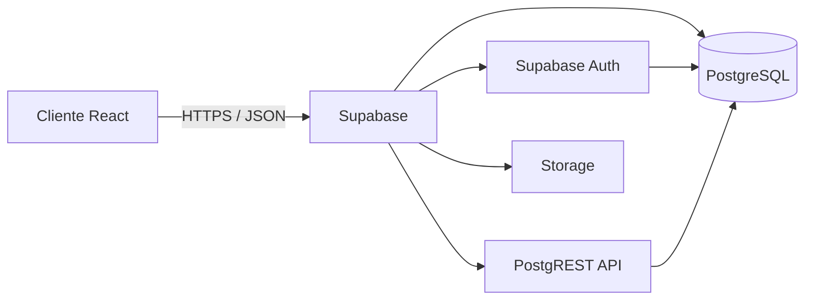
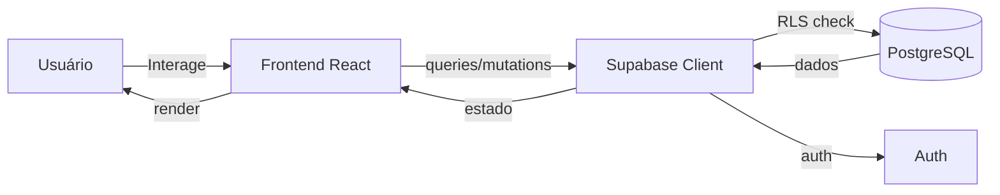

# Arquitetura

## Visão Geral

Lilás é uma rede social estilo Reddit construída como uma Single Page Application (SPA) em React, sem backend tradicional. Toda a lógica de servidor, banco de dados e autenticação é gerenciada pelo **Supabase**.

## Frontend

- **Framework:** React 18
- **Bundler:** Vite 5
- **Roteamento:** React Router 6 (BrowserRouter)
- **Estado global:** React Context (`AuthContext` para sessão e perfil)
- **Estilo:** CSS puro com variáveis CSS customizadas (`styles.css`)

### Padrão de Estado

O estado global mínimo necessário é gerenciado via Context:
- `session` — sessão do Supabase Auth
- `profile` — dados do perfil carregado de `profiles`
- `loading` — flag de carregamento inicial
- `refreshProfile` — função para recarregar perfil
- `signOut` — função de logout

## Backend (Supabase)

Não há servidor próprio. O cliente React se comunica diretamente com o Supabase via SDK JavaScript.

- **Banco:** PostgreSQL gerenciado pelo Supabase
- **Auth:** Supabase Auth (email OTP)
- **API:** PostgREST (auto-gerada a partir do schema)
- **Segurança:** RLS (Row Level Security) — 21 políticas cobrindo todas as tabelas
- **Storage:** (não utilizado no momento)

### Por que não há backend tradicional?

- O escopo do projeto é pequeno e acadêmico
- Supabase já fornece Auth, banco e API REST prontos
- Reduz custo de manutenção e deploy
- RLS garante segurança no banco sem código de servidor

## Deploy

- **Hospedagem:** Netlify
- **Build:** `vite build` gera pasta `dist/`
- **Config:** `netlify.toml` na raiz aponta `base = "client"`
- **Env vars:** Configuradas no painel do Netlify (`VITE_SUPABASE_URL`, `VITE_SUPABASE_ANON_KEY`)

## Fluxo de Dados

1. Usuário interage com a interface
2. Componentes chamam `supabase.from(...).select()/insert()/update()/delete()`
3. Supabase valida RLS antes de executar a query
4. Resultado retorna ao componente que atualiza o estado local
5. React re-renderiza a UI
