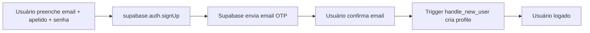
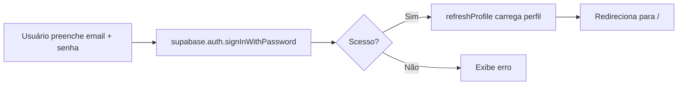

# Autenticação

## Visão Geral

A autenticação é gerenciada inteiramente pelo **Supabase Auth**. O projeto utiliza **email OTP** (One-Time Password) como método de autenticação.

## Fluxo de Cadastro (Signup)



1. Usuário acessa `/login` e seleciona "Criar conta"
2. Preenche email, apelido e senha
3. `supabase.auth.signUp()` é chamado com `options.data.apelido`
4. Supabase envia um email com código OTP (8 dígitos, válido por 1h)
5. Usuário confirma o email pelo link
6. Trigger `handle_new_user` cria automaticamente o registro em `profiles`

## Fluxo de Login (Signin)



1. Usuário acessa `/login` e seleciona "Entrar"
2. Preenche email e senha
3. `supabase.auth.signInWithPassword()` valida credenciais
4. Se sucesso, `refreshProfile()` carrega os dados do perfil
5. Redirecionamento para `/`

## Estado Global: `AuthProvider`

Localizado em `client/src/lib/auth.jsx`.

```jsx
<AuthContext.Provider value={{ session, profile, refreshProfile, signOut, loading }}>
```

### Estado

| Campo | Tipo | Descrição |
|-------|------|-----------|
| `session` | `Session \| null` | Sessão do Supabase Auth |
| `profile` | `Profile \| null` | Dados do perfil do usuário |
| `loading` | `boolean` | Indica carregamento inicial |
| `refreshProfile` | `() => Promise<void>` | Recarrega perfil do banco |
| `signOut` | `() => Promise<void>` | Encerra sessão |

### Comportamento

- **Inicialização:** Carrega sessão existente via `getSession()`
- **Mudança de auth:** `onAuthStateChange` atualiza `session` e limpa `profile` no logout
- **Profile:** Carregado via `maybeSingle()` após `session.user.id` mudar

## Proteção de Rotas: `RequireAuth`

Componente que envolve rotas protegidas.

```jsx
function RequireAuth({ children }) {
  const { session, loading } = useAuth()
  if (loading) return null
  if (!session) return <Navigate to="/login" replace />
  return children
}
```

- Enquanto `loading` é `true`, renderiza `null`
- Se não houver sessão, redireciona para `/login`
- Caso contrário, renderiza o conteúdo protegido

## Logout

```jsx
async function signOut() {
  await supabase.auth.signOut()
}
```

O `onAuthStateChange` do `AuthProvider` detecta o logout e limpa `session` e `profile` automaticamente.

## Considerações de Produção

- **Rate limit de email:** Supabase free tier limita a 2 emails/hora/IP
- **Domínios rejeitados:** `example.com`, `.test`, `.local` são rejeitados pelo GoTrue
- **SMTP custom:** Para produção, configure SMTP próprio (Resend, SendGrid) para aumentar o limite
