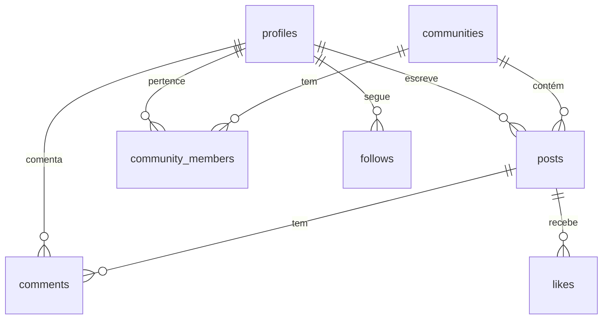

# Banco de Dados

## Visão Geral

O banco de dados é um PostgreSQL gerenciado pelo Supabase. Todas as tabelas estão protegidas por RLS (Row Level Security). Não há acesso direto ao banco fora do Supabase Dashboard.

## Tabelas

### `profiles`

Perfis de usuário. Criado automaticamente pelo trigger `handle_new_user` quando um usuário se cadastra.

| Campo | Tipo | Descrição |
|-------|------|-----------|
| `id` | `uuid` | Chave primária, mesmo ID de `auth.users` |
| `apelido` | `text` | Nome público (fantasy name), único |
| `avatar_url` | `text` | URL do avatar (opcional) |
| `bio` | `text` | Biografia do usuário (opcional) |
| `is_admin` | `boolean` | Flag de administrador |
| `created_at` | `timestamptz` | Data de criação |

**Relacionamentos:**
- `posts` → 1:N (`author_id`)
- `comments` → 1:N (`author_id`)
- `follows` → N:1 (`follower_id`, `following_id`)

### `communities`

Comunidades temáticas (subreddits).

| Campo | Tipo | Descrição |
|-------|------|-----------|
| `id` | `uuid` | Chave primária |
| `name` | `text` | Nome da comunidade (ex: `r/Mulheres`) |
| `slug` | `text` | Slug para URLs |
| `description` | `text` | Descrição |
| `category` | `text` | Categoria |
| `members` | `integer` | Contagem de membros |
| `image_url` | `text` | URL da imagem de capa (opcional) |

**Relacionamentos:**
- `posts` → 1:N (`community_id`)
- `community_members` → N:M com `profiles`

### `community_members`

Tabela de junção entre usuários e comunidades.

| Campo | Tipo | Descrição |
|-------|------|-----------|
| `id` | `uuid` | Chave primária |
| `user_id` | `uuid` | Referência a `profiles(id)` |
| `community_id` | `uuid` | Referência a `communities(id)` |
| `joined_at` | `timestamptz` | Data de entrada |

### `posts`

Publicações dos usuários.

| Campo | Tipo | Descrição |
|-------|------|-----------|
| `id` | `uuid` | Chave primária |
| `author_id` | `uuid` | Referência a `profiles(id)` |
| `community_id` | `uuid` | Referência a `communities(id)` |
| `title` | `text` | Título do post |
| `body` | `text` | Conteúdo do post |
| `image_url` | `text` | URL de imagem (opcional) |
| `tag` | `text` | Tag de contexto (ex: `Dúvida`, `Conseguiu`) |
| `link_url` | `text` | URL de post do tipo link |
| `poll_options` | `text[]` | Opções da enquete (nulo = não é enquete) |
| `created_at` | `timestamptz` | Data de criação |

**Relacionamentos:**
- `profiles` → N:1 (`author_id`)
- `communities` → N:1 (`community_id`)
- `comments` → 1:N
- `likes` → 1:N

### `comments`

Comentários em posts.

| Campo | Tipo | Descrição |
|-------|------|-----------|
| `id` | `uuid` | Chave primária |
| `post_id` | `uuid` | Referência a `posts(id)` |
| `parent_id` | `uuid` | Referência a `comments(id)` (opcional; nulo = comentário de nível superior) |
| `author_id` | `uuid` | Referência a `profiles(id)` |
| `body` | `text` | Texto do comentário |
| `created_at` | `timestamptz` | Data de criação |

### `likes`

Curtidas em posts.

| Campo | Tipo | Descrição |
|-------|------|-----------|
| `id` | `uuid` | Chave primária |
| `post_id` | `uuid` | Referência a `posts(id)` |
| `user_id` | `uuid` | Referência a `auth.users(id)` |
| `created_at` | `timestamptz` | Data de criação |

> **Nota:** `user_id` referencia `auth.users(id)` para desambiguar relações PostgREST.

### `follows`

Relação de seguir usuários.

| Campo | Tipo | Descrição |
|-------|------|-----------|
| `id` | `uuid` | Chave primária |
| `follower_id` | `uuid` | Referência a `profiles(id)` |
| `following_id` | `uuid` | Referência a `profiles(id)` |

### `poll_votes`

Votos em enquetes. Um voto por usuário por post (PK composta).

| Campo | Tipo | Descrição |
|-------|------|-----------|
| `post_id` | `uuid` | Referência a `posts(id)` |
| `user_id` | `uuid` | Referência a `auth.users(id)` |
| `option_idx` | `integer` | Índice da opção escolhida |

### `community_mods`

Moderadoras de comunidade, nomeadas pelo admin da plataforma.

| Campo | Tipo | Descrição |
|-------|------|-----------|
| `community_id` | `uuid` | Referência a `communities(id)` |
| `user_id` | `uuid` | Referência a `profiles(id)` |
| `added_by` | `uuid` | Admin que nomeou |

### `community_bans`

Usuárias bloqueadas de uma comunidade (não conseguem entrar).

Estrutura igual a `community_mods`, com `banned_by`.

> `communities.rules` (text) guarda as regras da comunidade, editadas por mods.

## Funções

| Função | Retorno | Descrição |
|--------|---------|-----------|
| `karma_of(user)` | `int` | Soma dos votos recebidos em posts + comentários do usuário |
| `is_admin()` | `boolean` | Usuária atual é admin |
| `is_mod_of(community)` | `boolean` | Usuária atual é mod da comunidade (admin conta como mod) |
| `vote_post(post, vote)` / `vote_comment(comment, vote)` | `int` | Voto atômico, retorna novo placar |
| `sync_community_members()` | trigger | Mantém `communities.members` em sincia |
| `delete_account()` | `void` | Exclui a conta e todos os dados |

## Diagrama ER

## Triggers

### `handle_new_user`

Dispara automaticamente após `INSERT` em `auth.users`. Cria um registro em `profiles` com:
- `id` = `NEW.id`
- `apelido` = valor de `raw_user_meta_data->>'apelido'` ou fallback `user_<id>`

Isso garante que todo usuário que se cadastra já tenha um perfil associado.

## RLS (Row Level Security)

Todas as 7 tabelas possuem RLS habilitado. O total de políticas é 21.

### Políticas por Tabela

| Tabela | Tipo de Política | Exemplo |
|--------|-----------------|---------|
| `profiles` | SELECT público | Qualquer usuário autenticado pode ler perfis |
| `profiles` | UPDATE próprio | Usuário pode editar apenas seu próprio perfil |
| `communities` | SELECT público | Todos podem listar comunidades |
| `community_members` | INSERT/Delete próprio | Entrar/sair; INSERT bloqueado se banida |
| `posts` | SELECT público | Todos podem ler posts |
| `posts` | INSERT autenticado | Autor é a própria usuária; conta nova (<24h) limitada a 5 posts/dia |
| `posts` | DELETE próprio/mod/admin | Autora, admin ou mod da comunidade pode deletar |
| `comments` | SELECT público | Todos podem ler comentários |
| `comments` | INSERT autenticado | Usuário autenticado pode comentar |
| `comments` | DELETE próprio/mod/admin | Autora, admin ou mod da comunidade pode deletar |
| `communities` | UPDATE mod/admin | Mods editam regras da comunidade |
| `poll_votes` | SELECT autenticado / INSERT+UPDATE próprio | Votar e trocar o voto |
| `community_mods` / `community_bans` | Leitura aberta / escrita admin (mods p/ bans) | Gestão de moderação |
| `likes` | INSERT/DELETE próprio | Usuário pode curtir/descurtir |
| `follows` | INSERT/DELETE próprio | Usuário pode seguir/deixar de seguir |

> **Nota:** Detalhes exatos das políticas devem ser confirmados no Supabase Dashboard. A aplicação assume que RLS está corretamente configurado para os fluxos implementados.

## Dados Seed

5 comunidades são criadas automaticamente na inicialização:

- `r/AgostoLilas`
- `r/Mulheres`
- `r/LeiMariaPenha`
- `r/SaudeFeminina`
- `r/Enfrentamento`
