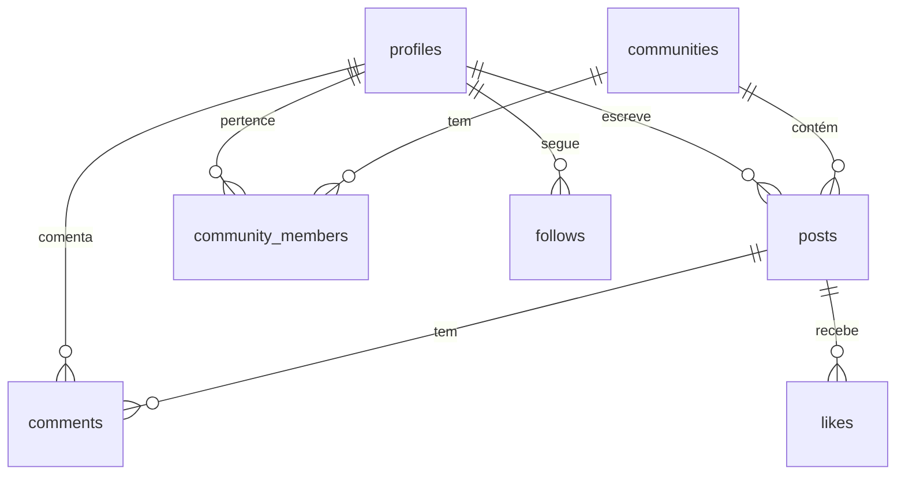

# Banco de Dados

## Visão Geral

O banco de dados é um PostgreSQL gerenciado pelo Supabase. Todas as tabelas estão protegidas por RLS (Row Level Security). Não há acesso direto ao banco fora do Supabase Dashboard.

## Tabelas

### `profiles`

Perfis de usuário. Criado automaticamente pelo trigger `handle_new_user` quando um usuário se cadastra.

| Campo | Tipo | Descrição |
|-------|------|-----------|
| `id` | `uuid` | Chave primária, mesmo ID de `auth.users` |
| `apelido` | `text` | Nome público (fantasy name), único |
| `avatar_url` | `text` | URL do avatar (opcional) |
| `bio` | `text` | Biografia do usuário (opcional) |
| `is_admin` | `boolean` | Flag de administrador |
| `created_at` | `timestamptz` | Data de criação |

**Relacionamentos:**
- `posts` → 1:N (`author_id`)
- `comments` → 1:N (`author_id`)
- `follows` → N:1 (`follower_id`, `following_id`)

### `communities`

Comunidades temáticas (subreddits).

| Campo | Tipo | Descrição |
|-------|------|-----------|
| `id` | `uuid` | Chave primária |
| `name` | `text` | Nome da comunidade (ex: `r/Mulheres`) |
| `slug` | `text` | Slug para URLs |
| `description` | `text` | Descrição |
| `category` | `text` | Categoria |
| `members` | `integer` | Contagem de membros |
| `image_url` | `text` | URL da imagem de capa (opcional) |

**Relacionamentos:**
- `posts` → 1:N (`community_id`)
- `community_members` → N:M com `profiles`

### `community_members`

Tabela de junção entre usuários e comunidades.

| Campo | Tipo | Descrição |
|-------|------|-----------|
| `id` | `uuid` | Chave primária |
| `user_id` | `uuid` | Referência a `profiles(id)` |
| `community_id` | `uuid` | Referência a `communities(id)` |
| `joined_at` | `timestamptz` | Data de entrada |

### `posts`

Publicações dos usuários.

| Campo | Tipo | Descrição |
|-------|------|-----------|
| `id` | `uuid` | Chave primária |
| `author_id` | `uuid` | Referência a `profiles(id)` |
| `community_id` | `uuid` | Referência a `communities(id)` |
| `title` | `text` | Título do post |
| `body` | `text` | Conteúdo do post |
| `image_url` | `text` | URL de imagem (opcional) |
| `created_at` | `timestamptz` | Data de criação |

**Relacionamentos:**
- `profiles` → N:1 (`author_id`)
- `communities` → N:1 (`community_id`)
- `comments` → 1:N
- `likes` → 1:N

### `comments`

Comentários em posts.

| Campo | Tipo | Descrição |
|-------|------|-----------|
| `id` | `uuid` | Chave primária |
| `post_id` | `uuid` | Referência a `posts(id)` |
| `parent_id` | `uuid` | Referência a `comments(id)` (opcional; nulo = comentário de nível superior) |
| `author_id` | `uuid` | Referência a `profiles(id)` |
| `body` | `text` | Texto do comentário |
| `created_at` | `timestamptz` | Data de criação |

### `likes`

Curtidas em posts.

| Campo | Tipo | Descrição |
|-------|------|-----------|
| `id` | `uuid` | Chave primária |
| `post_id` | `uuid` | Referência a `posts(id)` |
| `user_id` | `uuid` | Referência a `auth.users(id)` |
| `created_at` | `timestamptz` | Data de criação |

> **Nota:** `user_id` referencia `auth.users(id)` para desambiguar relações PostgREST.

### `follows`

Relação de seguir usuários.

| Campo | Tipo | Descrição |
|-------|------|-----------|
| `id` | `uuid` | Chave primária |
| `follower_id` | `uuid` | Referência a `profiles(id)` |
| `following_id` | `uuid` | Referência a `profiles(id)` |

## Diagrama ER

## Triggers

### `handle_new_user`

Dispara automaticamente após `INSERT` em `auth.users`. Cria um registro em `profiles` com:
- `id` = `NEW.id`
- `apelido` = valor de `raw_user_meta_data->>'apelido'` ou fallback `user_<id>`

Isso garante que todo usuário que se cadastra já tenha um perfil associado.

## RLS (Row Level Security)

Todas as 7 tabelas possuem RLS habilitado. O total de políticas é 21.

### Políticas por Tabela

| Tabela | Tipo de Política | Exemplo |
|--------|-----------------|---------|
| `profiles` | SELECT público | Qualquer usuário autenticado pode ler perfis |
| `profiles` | UPDATE próprio | Usuário pode editar apenas seu próprio perfil |
| `communities` | SELECT público | Todos podem listar comunidades |
| `community_members` | INSERT/Delete próprio | Usuário pode entrar/sair de comunidades |
| `posts` | SELECT público | Todos podem ler posts |
| `posts` | INSERT autenticado | Usuário autenticado pode criar post |
| `posts` | DELETE próprio/admin | Autor ou admin pode deletar |
| `comments` | SELECT público | Todos podem ler comentários |
| `comments` | INSERT autenticado | Usuário autenticado pode comentar |
| `comments` | DELETE próprio/admin | Autor ou admin pode deletar |
| `likes` | INSERT/DELETE próprio | Usuário pode curtir/descurtir |
| `follows` | INSERT/DELETE próprio | Usuário pode seguir/deixar de seguir |

> **Nota:** Detalhes exatos das políticas devem ser confirmados no Supabase Dashboard. A aplicação assume que RLS está corretamente configurado para os fluxos implementados.

## Dados Seed

5 comunidades são criadas automaticamente na inicialização:

- `r/AgostoLilas`
- `r/Mulheres`
- `r/LeiMariaPenha`
- `r/SaudeFeminina`
- `r/Enfrentamento`
